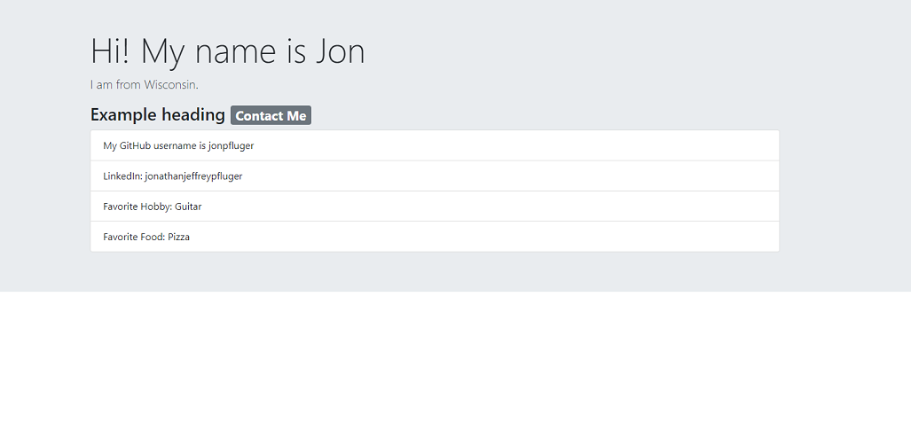

# Portfolio Generator

## Description

This application is a command-line tool that generates an HTML portfolio page from user input.

## Installation

You’ll need the following tools and technologies:

* `fs` for writing to the file system

* `inquirer` version 8.2.4 for collecting user input

## Example

